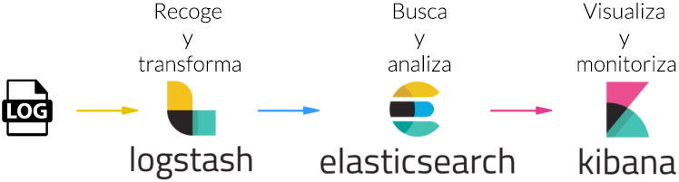

# Arquitectura de las herramientas Elastic
En este capítulo vamos a profundizar en el uso de las herramientas de Elastic para el análisis de datos de Contrataciones Abiertas en México. Para eso es necesario comprender mejor cómo se relacionan las diferentes herramientas antes de explicar cómo importaremos los datos.

La plataforma ELK tiene una arquitectura lineal entre sus componentes.

1. Los datos son recogidos y procesados por LogStash
1. LogStash envía los datos ya procesados a ElasticSearch para ser indexados
1. ElasticSearch proporciona los datos a la interfaz de Kibana para poder ser consultados

Pero veamos un poco más a detalle cada herramienta:

- [ElasticSearch](Seccion2/1_ElasticSearch.md)
- [Logstash](Seccion2/2_Logstash.md)
- [Kibana](Seccion2/3_Kibana.md)

Una vez que hemos conocido los conceptos básicos de las herramientas que utilizaremos, en el siguiente capítulo aprenderemos como planeamos utilizar ELK para lograr el análisis de los datos de contrataciones del gobierno Mexicano disponibles en formato OCDS.

[Inicio](../README.md) | [Anterior: Las herramientas Elastic](Seccion1.md) | [Siguiente: Plataforma ELK para el Análisis de Contrataciones en formato OCDS](Seccion3.md)
