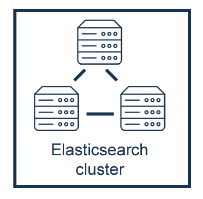

# ElasticSearch

Es un motor de base de datos distribuida tolerante a fallos y de alta disponibilidad.

Esto significa que la herramienta sirve para almacenar, indexar, filtrar y mostrar datos. Esta diseñada para continuar su funcionamiento ante la falla de equipos, ya que se puede organizar como una "red de nodos". Es decir, una misma base de datos puede estar replicada en multíples computadoras conectadas en red, y los datos contenidos pueden estar compartidos en todos los nodos, ya sea de forma integra o "en pedazos" a los que se denomina "data shards" o "shards".

Esta arquitectura distribuída permite que una base de datos en ElasticSearch siga funcionando aún cuando uno o varias de las computadoras que componen la red (nodos) deje de funcionar, y que los nodos puedan estar en diferentes ubicaciones físicas para lograr una velocidad uniforme del mismo sistema en diferentes ubicaciones.

De la misma forma en que ElasticSearch distribuye la información, también distribuye el procesamiento de consultas de datos. Cuando se realiza una búsqueda en la base de datos y esa información se encuentra distribuida, será tarea de cada nodo procesar dicha consulta y devolver la información que tenga disponible. Al final, el sistema en su conjunto creará un resultado final conjuntando los segmentos devueltos por cada nodo.

Esto permite que un sistema basado en ElasticSearch y configurado apropiadmente pueda realizar consultas complejas, en grandes cantidades de datos conservando un excelente rendimiento para el usuario final, más allá de su ubicación.

## Conceptos de ElasticSearch

### Cúmulo (Cluster)

Al conjunto de nodos en ElasticSearch se le conoce como "Cluster", un Cluster puede tener uno o más nodos.
Un cluster tendrá un nombre único, y los nodos reconoceran el cluster al que pertenecen por este nombre.
Es completamente válido tener un cluster con un solo nodo, y esto resulta mucho más sencillo de configurar, por lo que será el ejemplo elegido en este manual.

### Nodo (Node)

Un nodo es un "servidor" de ElasticSearch, normalmente esto se traduce en una sola computadora.
Cada nodo tendrá un nombre único e irrepetible en el cluster.

### Índice (Index)

En ElasticSearch las bases de datos se conocen como Índices, un índice funciona parecido a los viejos índices de biblioteca y contienen referencias a una colección de documentos que comparten ciertas características.
Un índice también tiene un nombre único, y se le puede o no definir las características de los documentos antes de agregar los documentos.

Por ejemplo, se puede tener un índice "clientes" que referencia a una seria de documentos con datos personales de los clientes de una tienda, todos tendrán un nombre, una dirección, edad, etc.

De la misma forma se puede tener, en el mismo cluster ElasticSearch otro índice "productos", que contendrá documentos describiendo cada uno de los productos que se venden en esa tienda.

A estos índices se pueden hacer consultas, actualizaciones, borrado o agregado de datos usando el nombre correspondiente.

### Documento (Document)

La unidad básica de información de ElasticSearch es el Documento, y estos documentos son almacenados en formato [JSON](https://es.wikipedia.org/wiki/JSON) lo que ofrece una flexibilidad y simplicidad para guardar cualquier tipo de datos.

A la acción de "guardar datos" en la base de datos ElasticSearch se le conoce como "indexar datos" o "indexar documentos"

### Fragmento (Shard)

> El más técnico de los conceptos aquí presentados pero es importante para entender como funciona un Indice de ElasticSearch.

Un índice puede contenr mucha más información de la que es posible almacenar físicamente en una sola computadora o de la que sería eficiente procesar en una sola computadora. Para solucionar este problema, ElasticSearch puede subdividir los índices en fragmentos más pequeños llamados "shards".

Esta función es la que le permite a ElasticSearch ser eficiente con cantidades de datos monumentales, pues subdividiendo el índice permite que se puedan agregar más nodos al cluster y los documentos pueden estar distribuidos entre todos los nodos.

En su forma más básica podemos tener un solo shard, aunque no es una práctica recomendada, pero esa será una decisión que deberemos tomar según la cantidad de datos a indexar y la cantidad de recursos disponibles. Para más información podemos consultar: [¿Cuántos shards debo tener en mi cluster de Elasticsearch?](https://www.elastic.co/blog/cuantos-shards-debo-tener-en-mi-cluster-de-elasticsearch)
