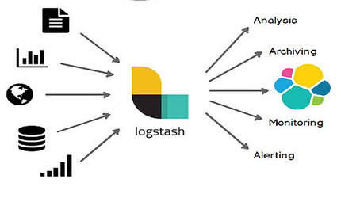

# Logstash

Motor de recolección, procesamiento y redistribución de datos. Logstash es una herramienta muy valiosa cuando trabajamos con distintas fuentes de datos o con datos no centralizados. Podemos describir a Logstash como una máquina que toma datos de los lugares indicados (recolección), los transforma (procesamiento) y luego puede enviarlos a otros sistemas en un nuevo formato (redistribución).

Estos tres pasos componen lo que se conoce como un "Pipeline" en Logstash.

## Recolección de datos

Logstash puede ser configurado de tal manera que puede observar una carpeta (u otro origen) de tal manera que cuando nuevos archivos de datos sean creados o cuando en los archivos especificados nuevos registros sean agregados, esta nueva información será leída de forma automática y enviada a procesamiento.

Esto es de gran utilidad en sistemas que generan miles de registros por minuto (o segundo!) y toda esa información debe ser procesada y analizada.

En el caso de datos finales, donde tenemos una sola fuente de información, ya sea en uno o varios archivos, también es posible configurar Logstash para que estos sean leídos una sola vez.

Para lograr esto, Logstash utiliza un sistema de extensión (plugins) de entrada: [Input Plugins](https://www.elastic.co/guide/en/logstash/current/input-plugins.html) que permiten leer información de muy diversas formas, formatos y sistemas.

## Procesamiento de datos

Una vez que Logstash ha recolectado los nuevos datos, es posible decirle a Logstash que tipo de transformaciones queremos hacer sobre los datos. Podemos, por ejemplo, tomar datos en [CSV](https://es.wikipedia.org/wiki/Valores_separados_por_comas) y convertirlo en un documento [JSON](https://es.wikipedia.org/wiki/JSON), también podríamos tomar un archivo con un formato propio, no estandarizado y pasarlo a otro ya estandarizado.

Para lograr esto, Logstash tiene a su disposición una colección de plugins llamados "filtros": [Filter plugins](https://www.elastic.co/guide/en/logstash/current/filter-plugins.html), cada filtro permite hacer una transformación especifica y pueden ser usados en combinaciones.

## Redistribución o Salida de datos

Una vez que el Pipeline de Logstash ha recolectado y transformado la información podemos indicar que hacer con el resultado. Las opciones disponibles también son muy diversas, los nuevos datos ya procesados pueden ser enviados a nuevos archivos, o pueden ser enviados por correo, pero muy comúnmente la salida más utilizada es enviar esta información a una base de datos ElasticSearch.

Las opciones oficiales de plugins de salida están listadas en esta página: [Output Plugins](https://www.elastic.co/guide/en/logstash/current/output-plugins.html)

---

**Nota sobre Logstash y ElasticSearch**
Utilizar estas dos herramientas conjuntamente brinda muchos beneficios, pero cabe señalar que es posible enviar datos a ElasticSearch directamente **sin** usar Logstash.
Esto se logra utilizando una funcionalidad de ElasticSearch conocida como "Ingesta" o "Ingest Pipeline", que convierte un nodo del clúster en un nodo especializado en recibir y procesar información.
Sin embargo no ahondaremos en esta modalidad, ya que no se utiliza en este manual. Aunque es funcional, tiene opciones limitadas, además de agregar carga de procesamiento a nuestro clúster de ElasticSearch.
