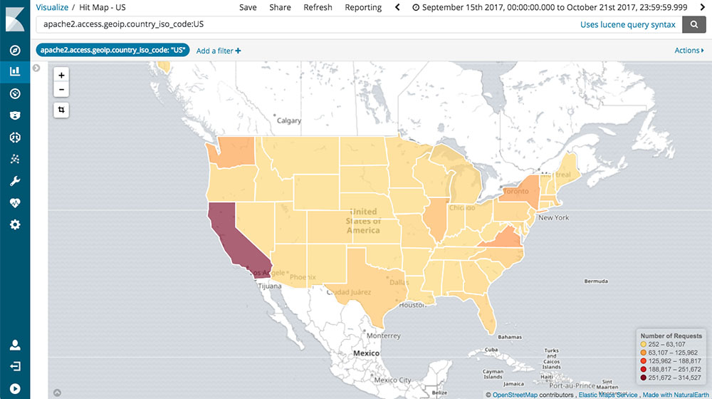

# Kibana

ElasticSearch y Logstash pueden ser utilizados mediante código especializado, y aunque podemos realizar consultas a los índices de esta forma, una parte muy importante es disponer de estas bases de datos a todo tipo de usuarios. Esa es la importancia de Kibana.

Kibana es la interfaz de usuario de la plataforma ELK. Y permite realizar análisis, consultas y visualizaciones de distintos tipos de los datos en nuestros índices.

## Funcionalidades

### Explorar los datos (Discover)

Una de las funcionalidades más basicas de Kibana es poder explorar los datos, documento a documento, o mediante consultas especializadas.

Más adelante conoceremos más sobre el lenguaje ([Query DSL](https://www.elastic.co/guide/en/elasticsearch/reference/6.3/query-dsl.html)) que Kibana y ElasticSearch utilizan para la construcción de consultas más avanzadas.

### Visualizar los datos (Visualize)

En esta función podremos crear gráficas, mapas y otro tipo de visualizaciones con los datos en nuestros índices.

> Obviamente nuestros documentos deberán contener información como coordenadas geográficas si queremos visualizarlo en un mapa, o datos numéricos si queremos realizar una gráfica con algunos totales.

### Crear y compartir tables de información (Dashboard)

Esta función es muy popular cuando ya tenemos definidos qué es lo que información queremos obtener de nuestros índices y de que forma queremos visualizarlo.

Un Dashboard es una colección de visualizaciones que se actualizan en tiempo real y que pueden ser compartidas a usuarios fuera de la plataforma.

### Consola de desarrollo y otras funciones

Entre otras herramientas, Kibana también permite realizar consultas manuales sobre nuestros clusters e índices usando una consola de desarrollador.

Tambien, dependiendo de las configuraciones, puede exhibir un panel de administración de usuario, índices y documentos.

Y en funcionalidad más avanzada también permite monitorear el correcto funcionamiento de nuestra plataforma ELK por completo.

## Más ejemplos

