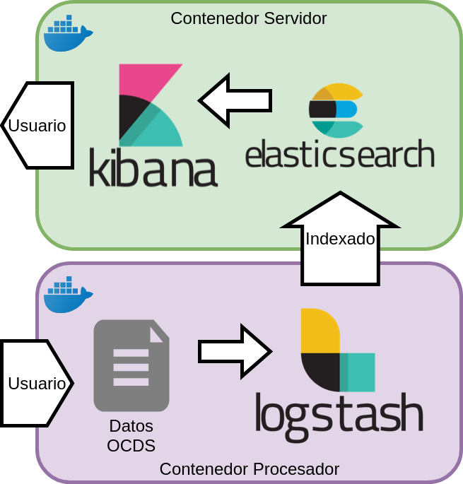

# Plataforma ELK para el Análisis de Contrataciones en formato OCDS

Como establecimos en la introducción de este manual, el análisis de los datos de contrataciones públicas de Mexico es una tarea indispensable para la correcta fiscalización democrática de las operaciones gubernamentales.

Para lograr este análisis debemos contar con las herramientas tecnológicas para tomar el Estándar OCDS y ponerlo a disposición del público de una forma amigable que permita refinar la información así como crear visualizaciones de estos datos.

La plataforma ELK (ElasticSearch, Logstash, Kibana) proveé de las herramientas necesarias para lograr este objetivo.

El presente manual permitirá realizar un sistema con las siguientes carácteristicas:

- Interfaz gráfica de uso amigable pero robusto para consultar los datos.
- Un motor de busqueda e indexado que permita la actualización y corrección de los datos en todo momento.
- Un motor de ingesta de datos, que permita que segun se realicen las publicaciones de los datos por parte del gobierno Mexicano estos puedan ser procesados e ingresados a la base de datos con un mínimo esfuerzo.

## Arquitectura

Cada una de estas funcionalidades estarán sustentadas en las herramientas Kibana, ElasticSearch y Logstash, y la arquitectura para su utilización quedará definida de la siguiente manera:

- Cluster ElasticSearch para indexar y contener los datos.
    - Inicialmente el cluster tendrá un solo nodo, según la demanda lo indique se podría incrementar el número de nodos.
    - Un índice especializado con los datos completos liberados.
- Interfaz de Kibana para visualizar los datos en el índice.
    - Tanto Kibana como ElasticSearch estarán inicialmente contenidos en un mismo contenedor Docker para su sencilla distribución.
- Un pipeline para Logstash preparado para tomar los datos OCDS, procesarlos e indexarlos en ElasticSearch
    - Este pipeline estará contenido en un contenedor Docker para su facil ejecución.

Llamaremos **Contenedor Servidor** en el que tenemos a ElasticSearch y Kibana, ya que este contenedor se mantendrá en ejecución tanto tiempo como se quiera ofrecer este servicio.

Y **Contenedor Procesador** al que solo ejecuta Logstash para procesar los datos y se da por terminado.

### Extra: Contenedores Docker

Un contenedor Docker es una herramienta que utilizaremos para empaquetar nuestra solución, su arquitectura y las herramientas.

Este manual no contempla enseñar los detalles de Docker y su tecnología pero podriamos definirlo de forma sencilla como "cajas" o "contenedores" (como de Trailers o de barcos de carga) de Software donde va incluido absolutamente todo lo que necesitamos para ejecutar nuestro proyecto.

En teoría esto debería facilitar mucho la distribución de cualquier herramienta de Software pues el unico prerequisito a instalar es Docker en sí mismo. Este paso debería ser muy parecido a instalar cualquier otro software en la plataforma de cómputo que se elija.

Una vez instalado Docker, nuestro software estará listo para iniciarse "automáticamente", sin necesitar de ningun tipo de software auxiliar ni dependencias.

Otra ventaja de usar Docker es que mantiene estabilidad entre lo que se desarrolla y lo que se distribuye, se evitan problemas del tipo "surgieron problemas en tu computadora pero en mi computador si funciona".

Para saber más sobre Contenedores y Docker, se recomiendan las siguientes lecturas:
- [Amazon Web Services - Qué es Docker?](https://aws.amazon.com/es/docker/)
- [OpenWebinars - Docker](https://openwebinars.net/blog/docker-que-es-sus-principales-caracteristicas/)
- [1and1.mx - Instalación de Docker](https://www.1and1.mx/digitalguide/servidores/configuracion/tutorial-docker-instalacion-y-primeros-pasos/)

[Inicio](../README.md) | [Anterior: Arquitectura de las herramientas Elastic](Seccion2.md) | [Siguiente: Instalación y puesta en marcha de la herramienta](Seccion4.md)
