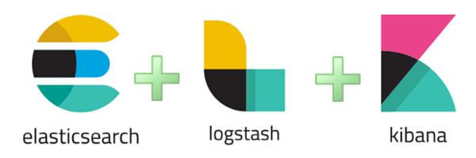

# Resúmen

Llegados a este punto hemos logrado tomar, procesar y visualizar datos publicados por el Gobierno Mexicano sobre sus
contrataciones, en este caso específico bajo el formáto estándar de contrataciones abiertas (OCDS).

Los presentes apuntes aunque creados para este caso de uso pueden ser replicados para otros, resaltando la importancia
de los fundamentos de la plataforma Elastic (ELK).

Procesar, Indexar y Visualizar cualquier conjunto de datos abiertos
es posible con estos conocimientos básicos.

A manera de resúmen, recordemos los siguientes puntos.

1. Existen 3 componentes de la plataforma ELK: ElasticSearch, Logstash y Kibana, cada uno con una tarea específica:
    - ElasticSearch almacena e indexa la informacion, es "la base de datos".
    - Kibana visualiza y ayuda a consultar la información.
    - Logstash compila, transforma e inserta los datos originales en ElasticSearch.
1. Una vez iniciado un servidor de ElasticSearch con Kibana podemos comenzar a enviar documentos al mismo para ser indexados.
1. Logstash es una herramienta muy flexible para tomar una colección de datos, leerla, transformarla para finalmente enviarla
a ElasticSearch.
1. Logstash utiliza "Pipelines" para procesar los datos, estos están compuestos de 3 partes: Entrada, Filtro, Salida.
1. El Pipeline está escrito en un "lenguaje" propio que describe cada proceso de forma lógica y clara, con la flexibilidad
disponible para realizar acciones complejas con instrucciones de código de programación.
1. Una vez escrito el Pipeline este puede ser usado multiples veces, incluso para crear índices distintos dentro de un mismo
servidor ElasticSearch.
