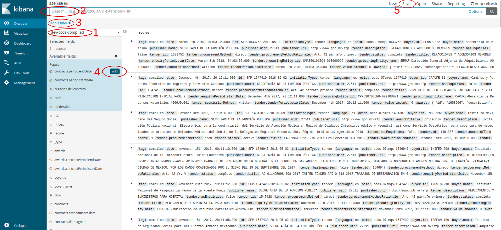

# Descubrir (Discover)

Tal y como su nombre indica, este primer apartado sirve para hacer una primera exploración de los datos. La pantalla de búsqueda está dividida en tres partes principales:
* Un buscador 
* Un mapeo de campos 
* Un espacio de resultados

Las principales acciones tanto para buscar como para configurar la visualización de la pantalla, son:
1. **Selector de índices**: En el desplegable se encuentran los distintos índices importados en la instancia de Kibana, este desplegable nos permite mover a través de ellos. Incluso algunos filtros se mantienen entre índices si hay campos coincidentes. 
2. **Buscador**: Nos permite hacer toda una serie de preguntas sobre nuestra base de datos, una forma de ver si nuestra query está funcionado es comprobar el recuento de "hits" que aparece justo encima del buscador. Algunas de las queries más habituales que se pueden usar son:   

<table border=1>
    <tr>
        <th>Acción</td>
        <th>Comando</td>
        <th>Ejemplo</td>
    </tr>
    <tr>
        <td>Buscar en cualquier campo</td>
        <td>string</td>
        <td>México</td>
    </tr>
    <tr>
        <td>Buscar en campo específico</td>
        <td>campo:string</td>
        <td>buyer.name:México</td>
    </tr>
    <tr>
        <td>Buscar texto específico en campo específico</td>
        <td>campo:"string"</td>
        <td>buyer.name:"Telecomunicaciones de México"</td>
    </tr>
    <tr>
        <td>Buscar dos textos en un campo</td>
        <td>campo:("string" OR "string")</td>
        <td>buyer.name:("Telecomunicaciones de México" OR " Tecnológico Nacional de México")</td>
    </tr>
    <tr>
        <td>Buscar en dos campos a la vez</td>
        <td>campo:"string" AND campo:"string"</td>
        <td>buyer.name:"Telecomunicaciones de México" AND tender.title:servicios</td>
    </tr>
    <tr>
        <td>Más grande o más pequeño</td>
        <td>campo:>valor</td>
        <td>contracts.value.amount:(>100000 AND <1000000)</td>
    </tr>
    <tr>
        <td>Wildcards, valores desconocidos</td>
        <td>c?mp*</td>
        <td>M?xic*</td>
    </tr>
</table>

Para conocer más opciones repasar la documentación de [Query String Query](https://www.elastic.co/guide/en/elasticsearch/reference/6.x/query-dsl-query-string-query.html#query-string-syntax) y de [Lucene Query Syntax](https://www.elastic.co/guide/en/kibana/6.x/lucene-query.html).

3. **Filtros**: Los filtros gráficos pueden hacer más o menos las mismas operaciones de filtro que acabamos de ver en el buscador, con la ventaja de que se pueden sumar varios filtros con facilidad y que hay una opción para editar el filtro y hacerlo mucho más complejo siguiendo [este tutorial](https://www.elastic.co/guide/en/elasticsearch/reference/6.x/query-filter-context.html). Si se están haciendo filtros sobre campos que contienen strings verán que aparecen duplicadas, una con el nombre definido y otra que termina en *.keyword*, se recomienda usar la segunda. 

4. **Available fields**: La barra lateral sirve para poder inspeccionar las cabeceras de los datos, dar una primera visión de los datos que contienen y configurar el panel de resultados. 
    * _Configuración_: La ruedita que está al lado de "Availaible Fields" despliega una serie de opciones para que se muestren más o menos campos. En caso de datos no tabulares, como los de OCDS, se aconseja desmarcar "Hide missing fields", para que se muestren los campos que están dentro de otros campos. 
    * _Campos_: Todos los campos van acompañados de un símbolo que identifica el tipo de datos que contiene, el reloj cuando es temporal, el numeral o tecla gato para identificar numero, la "t" para identificar los textos o strings, un esfera mitad negra significa que el campo es un booleano, y el símbolo interrogante que desconoce que tipo de campo tiene, normalmente será porque contiene a su vez más campos a su interior. Al cliquear sobre un campo se desplegará un grafico que mapea los primeros 500 valores del campo. 
    * _Add_: El botón add, que está iluminado por el círculo rojo, sirve para que el panel de resultados en lugar de mostrar toda la tira de datos muestre solo aquel o aquellos valores seleccionados. Por ejemplo podríamos usar el campo `tender.numberOfTenderers` que muestra el número de oferentes en cada proceso de contratación, y una vez lo tenemos en el espacio de resultados ordenarlo para poder ver que contratos tiene más contendientes. 

5. **Save**: Como se dice al principio del apartado la opción visualizar en el apartado Discover sirve para una primera exploración, pero una vez ya conseguimos los resultados deseados podemos guardar esta búsqueda para graficarla o mandarla a un dashboard. 
