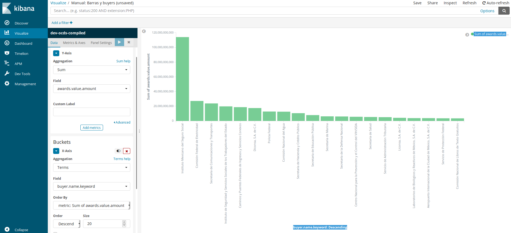

# Visualizar (Visualize)

Kibana además de un gran búscador es un potente visualizador de datos, que nos permite crear y guardar graficas de muchos tipos para el analisis de datos. 

Una vez entramos en el apartado visualizar nos aparece una tabla con las visualizaciones ya guardadas y un boton azul con un símbolo +, al clicarlo nos aparece toda una serie de opciones para trabajar y visualizar datos. 

## Gráfico de barras

Los gráficos de barras sirven para comparar un mismo rango de datos (por ejemplo el importe total) en distintas instancias (en este caso las depedencias de gobierno). Al seleccionarlo llegamos a una pantalla como la siguiente con todos los valores vacios.

Para replicar el gráfico el proceso es:
* **Y-Axis**
  * *Agregation:* En este punto seleccionamos como se agregaran los datos en nuestro gráfico. Por defecto nos da "Count", pero para conseguir los valores totales hemos de seleccionar la opción "Sum" y abré un nuevo desplagable llamadmo *Field* donde seleccionaremos `awards.value.amount`, que es el campo dónde están el valor de contrato.
  * *Custom label:* Campo de personalizción del grafico.
  * *Add metric:* El botón azul sirve por si queremos añadir otra metrica en el eje de la Y. Si quisieramos hacer un grafíco con barras agrupadas deberíamos seguir por este camino. 

* **Buckets / X-Axis** - Aunque hay dos otrasopciones **Split Series** y **Split Chart** para realizar este gráfico nos quedaremos con la primera opcion
  * *Agregation:* Nos abre un desplegable con multiples opciones, seleccionaremos "Terms" y apareceran una serie de campos.
  * *Field*: Seleccionamos la opción `buyer.name.keyword` (observaran no hay la opción sin keyword).
  * *Order by*: Ordernaremos por "metric.Sum of awards.value.amount", el valor que pusimos en el inicio, aunque también podríamos ordenar alfabeticamente o definir otro orden de la base de datos. 
  * *Order*: Seleccionaremos "Descending" para que aparezcan los mayores primeros. Si huberamos seleccionado otro *Orden by* las opciones se modificarian. 
  * *Size*: El numero de valores que vamos a mostrar en el grafico, 20 es un valor razonable
  * *Custom label:* Campo de personalizción del grafico.

Cuando ya tenemos todo el panel completo hemos de darle al botón de play en el recuadro azul y el gráfico aparecerá en la pantalla. Podemos modificar las distintas opciones para analizar a profundidad. 

## Tabla 

Cálculo de cuantos ganadores y tenderers hay para cada contato. 

## Grafico de tarta

Visión de las distintas Depenedencias, Unidades Compradoras y empresas para cada caso. 

## Gráfico de tiempo

Evolución de los contratos por dia 

## Otros graficos dispontibles
