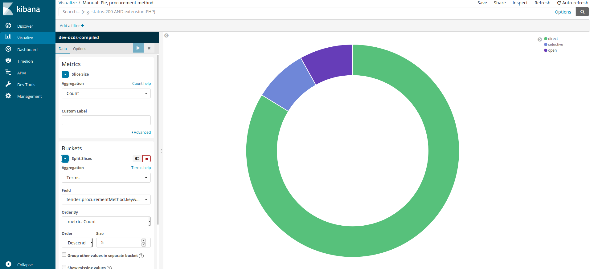
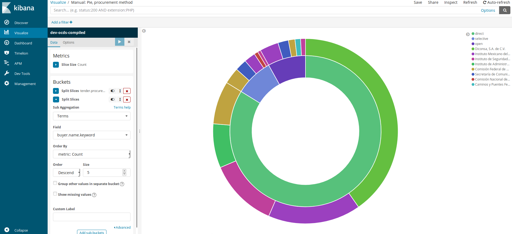
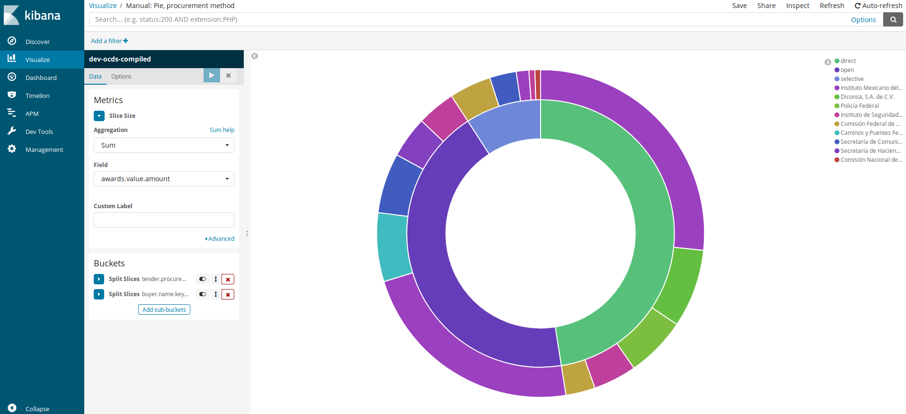
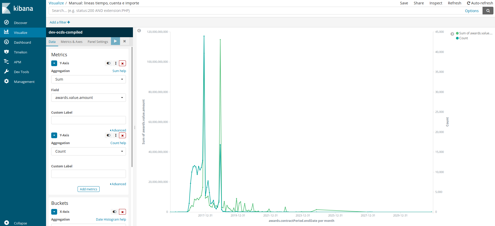

# Visualizar (Visualize)

Kibana además de un gran buscador es un potente visualizador de datos, que nos permite crear y guardar graficas de muchos tipos para el análisis de datos.

Una vez entramos en el apartado visualizar nos aparece una tabla con las visualizaciones ya guardadas y un botón azul con un símbolo +, al clicarlo nos aparece toda una serie de opciones para trabajar y visualizar datos. 

## Gráfico de barras

Los gráficos de barras sirven para comparar un mismo rango de datos (por ejemplo el importe total) en distintas instancias (en este caso las dependencias de gobierno). Al seleccionarlo llegamos a una pantalla como la siguiente con todos los valores vacíos.

Para replicar el gráfico el proceso es:
* **Y-Axis**
  * *Agregation:* En este punto seleccionamos como se agregaran los datos en nuestro gráfico. Por defecto nos da "Count", pero para conseguir los valores totales hemos de seleccionar la opción "Sum" y abre un nuevo desplegable llamado *Field* donde seleccionaremos `awards.value.amount`, que es el campo dónde están el valor de contrato.
  * *Custom label:* Campo de personalización del grafico.
  * *Add metric:* El botón azul sirve por si queremos añadir otra metrica en el eje de la Y. Si quisiéramos hacer un gráfico con barras agrupadas deberíamos seguir por este camino. 

* **Buckets / X-Axis** - Aunque hay dos otras opciones **Split Series** y **Split Chart** para realizar este gráfico nos quedaremos con la primera opción.
  * *Agregation:* Nos abre un desplegable con múltiples opciones, seleccionaremos "Terms" y aparecerán una serie de campos.
  * *Field*: Seleccionamos la opción `buyer.name.keyword` (observaran no hay la opción sin keyword).
  * *Order by*: Ordernaremos por "metric.Sum of awards.value.amount", el valor que pusimos en el inicio, aunque también podríamos ordenar alfabéticamente o definir otro orden de la base de datos. 
  * *Order*: Seleccionaremos "Descending" para que aparezcan los mayores primeros. Si huberamos seleccionado otro *Orden by* las opciones se modificarían. 
  * *Size*: El numero de valores que vamos a mostrar en el grafico, 20 es un valor razonable
  * *Custom label:* Campo de personalización del grafico.

Cuando ya tenemos todo el panel completo hemos de darle al botón de play en el recuadro azul y el gráfico aparecerá en la pantalla. Podemos modificar las distintas opciones para analizar a profundidad. 

## Gráfico de tarta

Los gráficos de tarta para saber que peso tiene cada uno de los elementos (procedimientos de contratación) sobre el conjunto (todo el dataset).

Para replicar el gráfico el proceso es:
* **Metrics**
  * *Agregation:* Dejaremos seleccionada el "Count"

* **Bucket / Splits Slices** ya que nos interesa generar los espacios de la tarda y no crear varias graficas de tarta. 
  * *Agregation:* Otra vez Terms
  * *Field*: `tender.procurementMethod.keyword`
  * *Order by*: "Count"
  * *Oder* Descent
  * *Size*: Dejamos 5 aunque son tres. 
  
Le damos al "play" y aparecerá el gráfico. Pero una vez visualizado queremos ver cuales son las dependencias que más han usado este dataset para y para esto hemos de clicar al botón con letra azul "Add sub-buckets" que está en el apartado de Buckets. Una vez allí repetiremos el proceso.

* **Bucket / Splits Slices**
  * *Agregation:* Otra vez Terms
  * *Field*: `buyer.name.keyword`
  * *Order by*: "Count"
  * *Oder* Descent
  * *Size*: Dejamos 5 aunque son tres. 

Cuando le demos al play nos saldrá este grafica con las 5 dependencias que más veces han echo ese tipo de contratación en el dataset. 

Siguiendo con el análisis queremos cambiar el agregado, no queremos que sea cuenta sinó importe total por procedimiento y dependencia. 
* **Metrics**
  * *Agregation:* seleccionaremos la opción de "Sum" y en el nuevo desplegable *Field* seleccionaremos `awards.value.amount`

Le volvemos a dar al play y nos da la siguiente grafica.

Podemos seguir analizando añadiendo y quitando valores. Para acelerar el proceso, al lado de cada "Split Slices", hay tres botones que permiten hacer la acciones "Mostrar/esconder", "modificar el orden de aparición" y "borrar el slice". Cada vez que se hace una modificación hay que apretar el botón de play. 

## Gráfico de lineas

Los gráficos de líneas nos sirven para mostrar la evolución durante el tiempo, en esta ocasión haremos un gráfico con dos valores: cuenta e importe. 

* **Metrics**
  * *Agregation:* seleccionaremos la opción de "Sum" y en el nuevo desplagable *Field* seleccionaremos `awards.value.amount`
  * Clicaremos en *Add metric*
  * *Agretation:* Dejaremos seleccionada el "Count"
  
* **Buckets / X-Axis** - Aunque hay dos otras opciones **Split Series** y **Split Chart** para realizar este gráfico nos quedaremos con la primera opción.
  * *Agregation:* Esta vez seleccionaremos "Date Histogram", ya que queremos hacer una serie temporal.
  * *Field:* Usaremos el campo `awards.contractPeriod.endDate`, la fecha en la que se otorga el contrato.
  * *Interval:* Seleccionaremos "Monthly", que nuestro dataset contiene datos de tres años. 
  
Si le diéramos play ahora, el gráfico quedaría solo con la linea verda, y la azul quedaría rozando al 0, ya que los valores entre ambas son muy distintos. Para que esto aparezca bien, hemos de crear un segundo eje de valores en la gráfica. Para esto hemos de hacer clicar en *Metrics & Axes* (el menú a la izquierda del botón play) y en el desplegable "Value Axis" clicar a la opción "New Axis", que nos generará un nuevo eje que podemos editar en la siguiente caja **Y-Axis**.

Observando el grafico podemos ver que termina en el 2020, cuando aún estamos en 2018. Para rectificar esto, podemos añadir un filtro a los datos, de la misma forma que lo hacemos en el apartado [Discover](https://manualkibanaocds.readthedocs.io/es/latest/C3/Seccion2.html) 

## Otros gráficos dispontibles

En Kibana hay muchas más opciones de crear gráficos, todos ellos con funcionamientos muy similares a los anteriormente descritos. Algunos recomendados son:
* **Tablas**: Permiten generar nuevas tablas y exportarlas a csv.
* **Área**: para valores acumulados en el tiempo.
* **Mapas**: cuando tenemos valores geográficos.
* **Redes**: Explorar las relaciones entre los distintos campos. 
