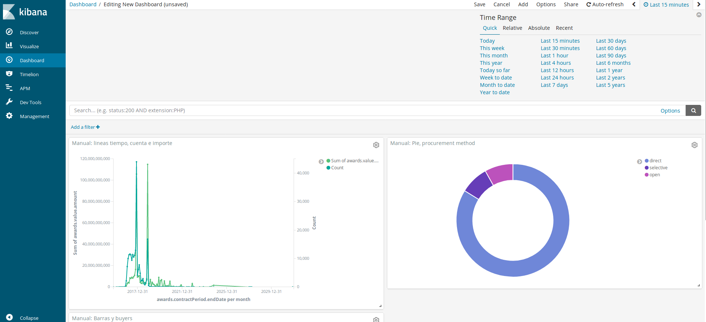

# Creación de Paneles (dashboard)

Al tener toda una serie de gráaficas guardas que nos sirven para el análisis y con una fuente de entrada de datos constante, el dashboard nos permite hacernos tableros de control para ver como están entrando los datos. Su configuración es muy simple, solo hay que apretar el botón «Add», seleccionar las gráaficas y/o búsquedas que ya tenemos gravbadas y se mostraráan en el tablero, que podremos configurar a nuestro gusto.

Además (en la imagen está desplegado) tenemos un selector de tiempo para que rápidamente podamos seleccionar el intervalo de tiempo en el que tenemos interés.

